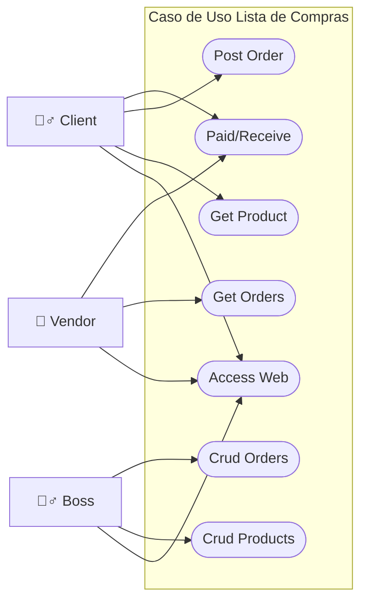
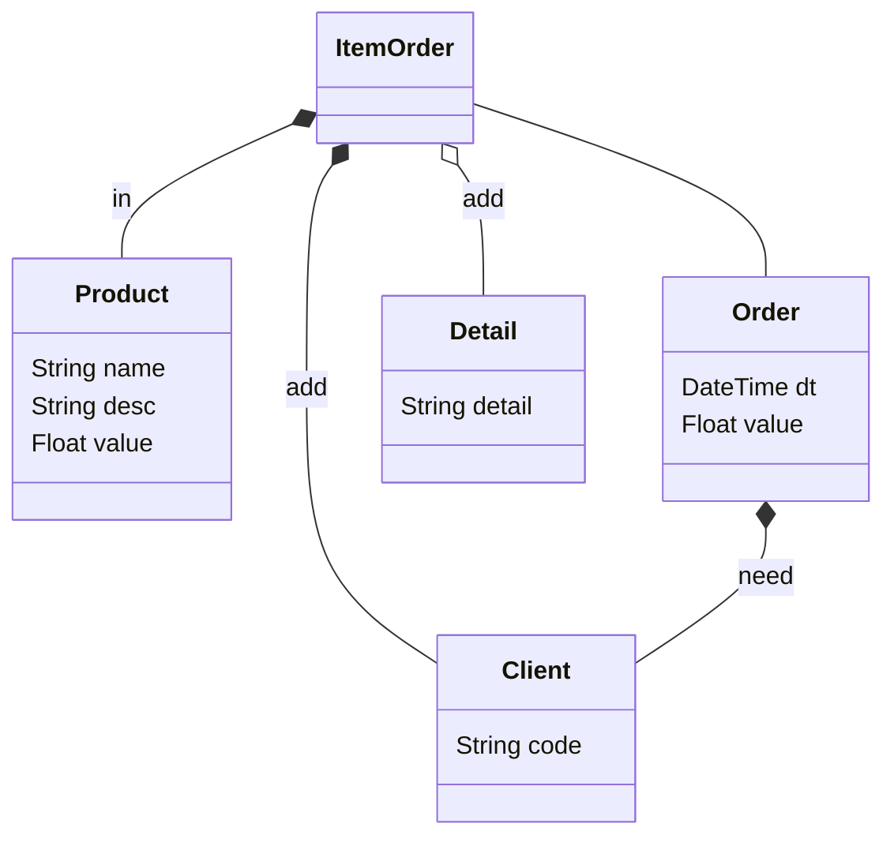
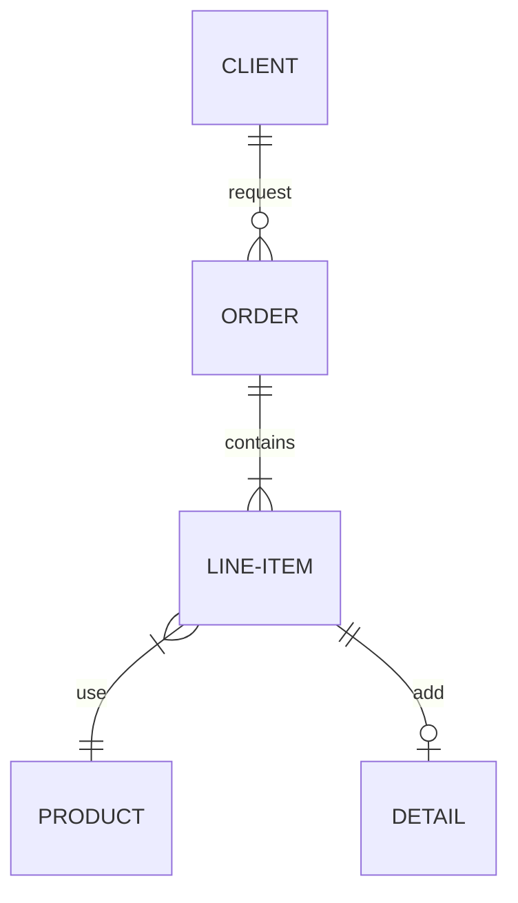
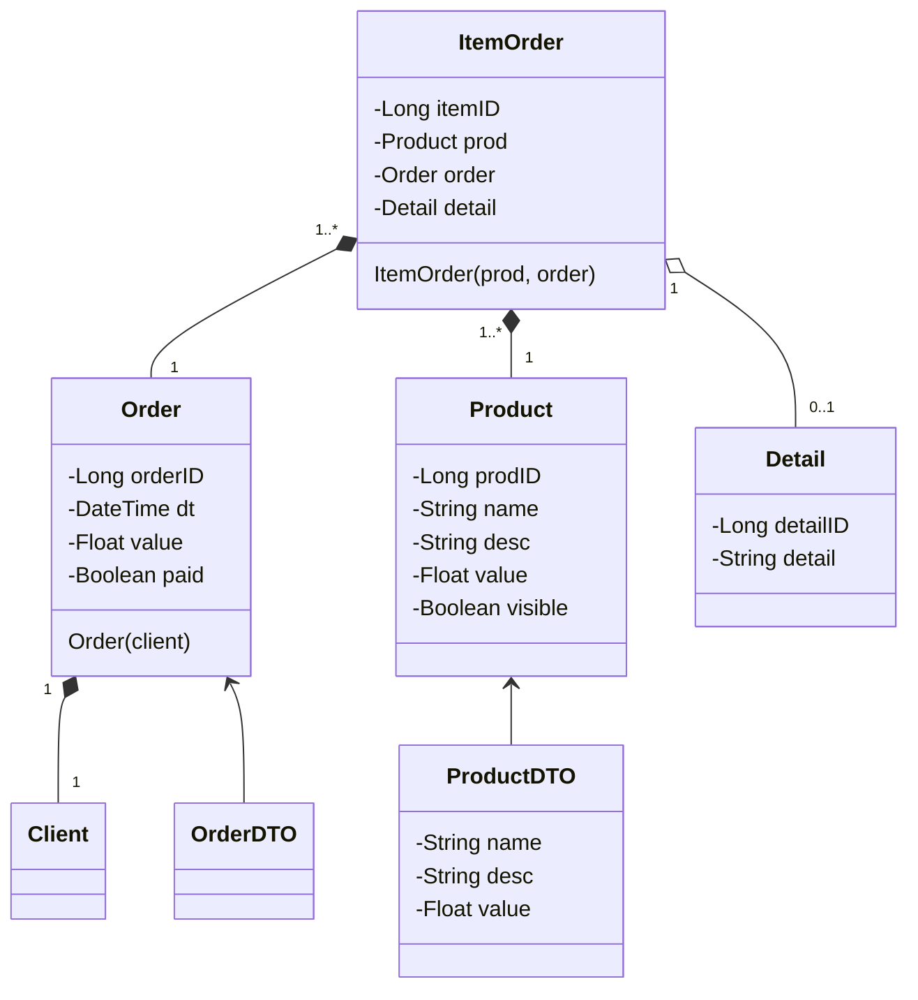

## Use Case

```mermaid
flowchart  LR
subgraph Caso de Uso Lista de Compras
a([Access Web])
b([Get Product])
c([Post Order])
d([Paid/Receive])
e([Get Orders])
f([Crud Products])
g([Crud Orders])
end
x["🧍‍♂ Client"] -->  a
x -->  b
x -->  c
x -->  d
y["🤰 Vendor"] -->  a
y --> e
y --> d
z["🧍‍♂ Boss"] -->  a
z --> f
z --> g
```

### Secuence Diagram

### Domain Model

```mermaid
classDiagram
ItemOrder *-- Client : add
ItemOrder *-- Product : in
ItemOrder -- Order
Order *-- Client : need
ItemOrder o-- Detail : add

Order: DateTime dt
Order: Float value
Product: String name
Product: String desc
Product: Float value
Detail: String detail
Client: String code
```
### Entity Relationship Diagram

```mermaid
erDiagram
CLIENT ||--o{ ORDER : request
ORDER ||--|{ LINE-ITEM : contains
LINE-ITEM }|--|| PRODUCT : use
LINE-ITEM ||--O| DETAIL : add
```
## Class Diagram

```mermaid
classDiagram
ItemOrder "1..*" *-- "1" Order
ItemOrder "1..*" *-- "1" Product
Order "1" *-- "1" Client
ItemOrder "1" o-- "0..1" Detail
Product <-- ProductDTO
Order <-- OrderDTO
class ItemOrder{
-Long itemID
-Product prod
-Order order
-Detail detail
ItemOrder(prod, order)
}
class Order{
-Long orderID
-DateTime dt
-Float value
-Boolean paid
Order(client)
}
class Product {
-Long prodID
-String name
-String desc
-Float value
-Boolean visible
}
class Detail {
-Long detailID
-String detail
}
class ProductDTO {
-String name
-String desc
-Float value
}
```